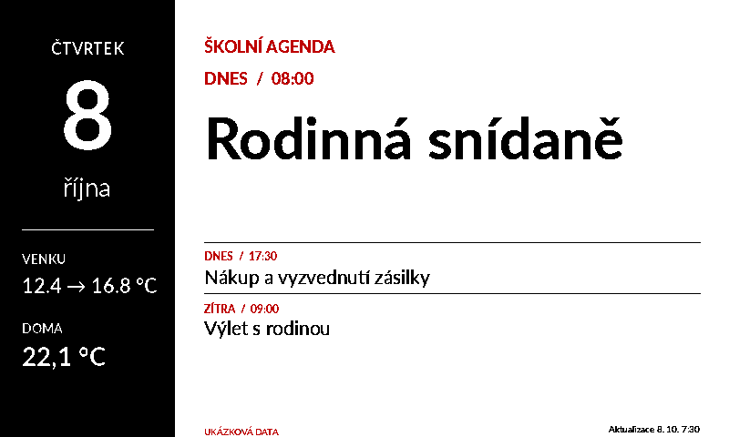
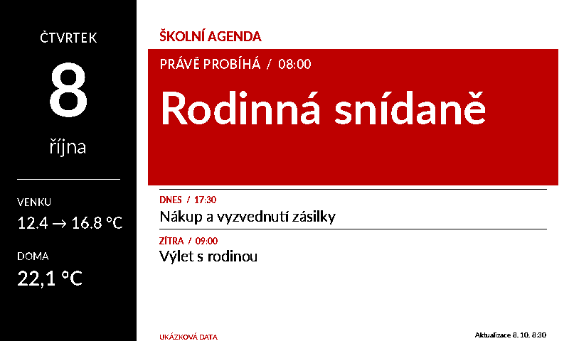

# E-ink rámeček — sjednocené zadání a nákup

Aktuální stav k 8. říjnu 2026. Toto je zadání poslední verze projektu.
Zdrojové soubory jsou v tomto repozitáři; [úplný výpis kódu](output/cely-kod.md)
je přiložený také jako jeden čitelný soubor.

## Cíl a architektura

Vytvořit domácí rámeček s 7,5palcovým tříbarevným e-ink displejem,
naprogramovatelnou agendou, datem a údaji z Home Assistantu. Rámeček používá
ESP32, domácí Wi-Fi a volitelnou baterii. Obraz vzniká v místní aplikaci
(add-onu) přímo na zařízení s Home Assistant OS. ESP32 stáhne hotový obraz,
obnoví displej a přejde do hlubokého spánku. Home Assistant zůstává zapnutý.

Google kalendář se připojí standardní integrací do Home Assistantu;
rámeček čte její calendar entity. Další zdroje lze později doplnit v rendereru.

## Tři varianty zobrazení

Náhledy používají ukázková data a pevně zvolené časy.

### Budoucí událost



### Probíhající událost



### Bez událostí v kalendáři


## Nákup

| Součástka | Množství | Účel a poznámka |
|---|---:|---|
| [Waveshare 7,5″ e-Paper HAT (B), tříbarevný](https://rpishop.cz/e-ink-displeje/4681-waveshare-75-e-paper-displej-hat-tribarevny.html) | 1 ks | 800 × 480, černá/bílá/červená. Balení podle nabídky obsahuje panel, Driver HAT, 8pin PH2.0 kabel 20 cm a dva RPi šrouby. Displej je nutné koupit. |
| [DFRobot FireBeetle 2 ESP32-E N16R2 / DFR1139](https://rpishop.cz/622131/dfrobot-firebeetle-2-esp32-e-n16r2-iot-vyvojova-deska-wifi-bluetooth/) | 1 ks | Řídicí deska s USB-C, 16 MB flash, 2 MB PSRAM a bateriovým konektorem. Nabíjecí část je na desce. |
| [Datový USB-A → USB-C kabel, 100 cm, 90°](https://rpishop.cz/usb-c/2007-datovy-a-napajeci-kabel-usb-usb-c-100cm-konektor-90-cerny.html) | 1 ks, pokud nemáš | Nahrání firmware, prvotní testování a nabíjení. Musí přenášet data. |
| USB zdroj 5 V, alespoň 1 A, s USB-A výstupem | 1 ks, pokud nemáš | Pro zkoušení a nabíjení přes uvedený kabel; za bateriového provozu není trvale připojený. Lze použít vhodný vlastní zdroj. |
| [Pimoroni LiPo 3,7 V / 2000 mAh](https://rpishop.cz/633085/lipo-nabijeci-baterie-3-7-v-2000-mah/) | 1 ks, podmíněně | Kandidát pro bateriovou verzi. Kapacitu a usazení potvrdit po měření; ověřit konektor a polaritu proti desce. |
| [IKEA RÖDALM, vzor bříza, 13 × 18 cm](https://www.ikea.com/cz/cs/p/roedalm-ram-vzor-briza-30548866/) | 1 ks | Na šířku. Vnější rozměry přibližně 200 × 150 × 30 mm. |
| Vlastní bílá nebo krémová pasparta | 1 ks | Orientačně 180 × 130 mm, otvor zhruba 162 × 97 mm; finální výřez podle skutečného panelu. Přiložená IKEA pasparta nemá vhodný otvor. |
| Zadní držák, případně hlubší kryt | 1 sada | Vlastní návrh/3D tisk až po změření vnitřní kapsy a elektroniky. |
| Šrouby, matice a distanční prvky | podle držáku | Zvolit závity, délky a výšky podle skutečných montážních otvorů. Původně uvažované 12mm sloupky nejsou potvrzené pro finální sestavu. |

FireBeetle obsahuje v balení samostatné pinové lišty. Pro toto zapojení je
potřeba připájet vhodnou lištu nebo zajistit tuto práci u prodejce. Tato
konkrétní varianta tedy není zaručeně bez pájení. Prototyp může potřebovat
propojovací vodiče podle skutečného zakončení dodaného kabelu a použité lišty.

Elektronický nákup tvoří FireBeetle, kompletní sada Waveshare a datový kabel;
baterie je přídavná část. Raspberry Pi, microSD, čtečka karty a samostatný
Waveshare ESP32 driver nejsou součástí současné architektury.

### Rozměry a ověření

Panel má dle nabídky obrys 170,2 × 111,2 mm a aktivní plochu 163,2 × 97,92 mm.
FireBeetle má dle výrobce rozměr 25,4 × 60 mm. Výrobce baterie pro 2000 mAh
uvádí přibližně 60 × 42,5 × 8,3 mm a ochranný obvod.
[Panel](https://rpishop.cz/e-ink-displeje/4681-waveshare-75-e-paper-displej-hat-tribarevny.html),
[FireBeetle](https://wiki.dfrobot.com/dfr1139/),
[baterie](https://shop.pimoroni.com/products/lipo-battery-pack).

Rozměry naznačují, že panel lze umístit do nominálního formátu 180 × 130 mm.
Skutečná kapsa, tloušťka panelu, kabely a prostor za ním dosud nejsou změřené.
Hloubka rámečku 30 mm není dostupná hloubka pro elektroniku. Panel opři mimo
aktivní sklo, bez svírání a tlaku; baterie musí mít samostatnou volnou kapsu.

Před nákupem/nahráním požádej prodejce o přesné označení panelu a revizi HATu.
Současný firmware má ovladač GxEPD2_750c_Z08 pro GDEW075Z08. Stejný obchodní
název může zahrnovat jiné revize. Dodaný jiný panel vyžaduje správnou třídu
ovladače. HAT s přidaným PWR pinem vyžaduje doplnění podle své dokumentace.
Samotné shodné rozlišení není důkaz kompatibility ovladače.

## Zapojení

Zapojování provádět s odpojeným USB i baterií. Používat čísla GPIO.
Napájení HATu jde z regulovaného 3V3, nikoli přímo z baterie.

| FireBeetle | Waveshare Driver HAT |
|---|---|
| 3V3 | VCC |
| GND | GND |
| GPIO23 | DIN / MOSI |
| GPIO18 | CLK / SCK |
| GPIO21 | CS |
| GPIO22 | DC |
| GPIO25 | RST |
| GPIO26 | BUSY |

Displej → flex konektor Driver HATu.
FireBeetle → dodaný 8pin kabel → Driver HAT.
LiPo → bateriový konektor PH2.0 na FireBeetle, až po ověření polarity a shody
konektoru. Označení „JST“ samo o sobě nezaručuje shodný konektor/polaritu.
USB zdroj nebo počítač → datový USB-A/USB-C kabel → USB-C na FireBeetle.
GPIO16 a GDI konektor se v tomto zapojení nepoužívají.

```text
Home Assistant OS + místní add-on
             │ domácí Wi-Fi / HTTP s tokenem
             ▼
      FireBeetle ESP32
             │ SPI + 3V3 + GND
             ▼
       Waveshare Driver HAT ── flex ── 7,5″ panel

LiPo ── PH2.0 BAT ── FireBeetle
5V USB zdroj ── USB-C ── FireBeetle (nabíjení / testování)
```

### Jak se baterie nabíjí

Baterie zůstává připojená k desce. Připojením 5V USB zdroje do USB-C se použije
vestavěná nabíjecí část FireBeetle; deska přepíná zdroje automaticky. Po odpojení
USB pracuje sestava z baterie. Pro tuto architekturu nepřidáváme druhou
nabíječku ani 5V boost měnič. Před první zkouškou ověřit povolený nabíjecí proud
konkrétní baterie, polaritu a chování nabíjecí části při současném provozu.
[Dokumentace FireBeetle](https://wiki.dfrobot.com/dfr1139/).

Firmware zatím neměří stav nabití a nemá vlastní mez pro vypnutí při nízkém
napětí. Ochranný obvod baterie je poslední ochrana; pro finální bateriovou verzi
je vhodné doplnit měření a vhodnou mez podle skutečného zapojení a baterie.
Výdrž celé sestavy nelze odvodit z klidového proudu samotného ESP32.

## Zadání pro kódování

### Data a konfigurace

- Rozlišení 800 × 480, pouze přesná černá/bílá/červená.
- Časová zóna Europe/Prague, včetně přechodů letního času.
- Kalendář `calendar.school`; další calendar entity přidávat seznamem.
- Aktuální venkovní teplota `input_number.outdoor_temperature`.
- Vnitřní teplota `input_number.natroom_temperature`.
- Venkovní denní maximum/předpověď `input_number.outdoor_effective_temperature`.
- Všechna input_number jsou hodnoty dodané HA; program předpověď ani maximum
  sám nepočítá. Jejich aktuálnost zajišťují automatizace v HA.
- Agenda načítá dnešek a zítřek (`agenda_days: 2`, nastavitelné 1–7 dní).
- Citát a autor jsou nastavitelné, výchozí text odpovídá referenci.

### Vzhled

- Vždy černý levý pruh přes celou výšku: den v týdnu, velké číslo dne bez
  tečky, český název měsíce bez roku a teploty.
- Venkovní hodnoty na jediném řádku: `12.4 → 16.8 °C`; pokud jsou numericky
  shodné (i 12.40 vs 12.4), zobrazit pouze `12.4 °C`.
- Písmo Lato. Hlavní událost Lato Bold 63 px, ostatní 21 px; trojnásobná
  velikost názvu. Nejvýše dva řádky, nadměrně dlouhý název zkrátit výpustkou.
- Nejvýše čtyři události: hlavní a tři další pod ní.
- Aktualizace např. `8. 10. 7:30`: den, měsíc a hodina bez úvodních nul,
  minuty vždy dvoumístné. Událostní čas může zůstat ve formátu `08:00`.

### Životní cyklus kalendáře — tři stavy

1. **Budoucí událost:** bílá hlavní plocha, tučný černý název, červené datum/čas.
2. **Probíhající událost:** podmínka `start ≤ nyní < end`; červený podklad,
   bílý text a označení „PRÁVĚ PROBÍHÁ“. Platí pro hlavní i další souběžné
   a celodenní události.
3. **Bez událostí v načítaném období:** citát s autorem, datum a teploty vlevo.

Událost se skryje, pokud `end ≤ nyní`. Zbylé události se řadí od nejdřívějšího
začátku. Prázdný kalendář se nesmí zaměnit za chybu načtení: chyba zobrazí
„KALENDÁŘ NENÍ DOSTUPNÝ“, nikoli citát. Neznámá/nedostupná hodnota je „—“.

### Server na HA OS

- Python + Pillow + Lato v místním add-onu, amd64/aarch64.
- Čtení HA REST API přes interní Supervisor proxy a SUPERVISOR_TOKEN;
  dlouhodobý HA token není nutné ručně zadávat.
- `GET /frame.bin`: hotové dvě bitové roviny a hlavička EIF1 s rozměry,
  dobou do probuzení a CRC32. Celkem 96016 bajtů.
- `GET /preview.png`: PNG pro kontrolu stejného rozložení.
- Oba endpointy vyžadují samostatný FRAME_TOKEN. Ten sdílí server a ESP32;
  Supervisor token se do ESP32 neukládá.
- HTTP je určen pro důvěryhodnou domácí LAN, bez veřejného vystavení. Současný
  firmware nepodporuje ověřované HTTPS; vzdálený provoz by potřeboval úpravu.

### ESP32, plánování a spánek

1. Připojit domácí 2,4GHz Wi-Fi s limitem 20 sekund.
2. Stáhnout celý obraz s tokenem; ověřit HTTP stav, délku, magic, rozlišení,
   dobu spánku a CRC32 před změnou displeje.
3. Při chybě zachovat předchozí obraz a zkusit znovu za 300 sekund.
4. Platný změněný obraz přenést přes SPI a provést plné obnovení.
5. Panel uvést do hibernace, Wi-Fi vypnout, ESP32 uspat časovačem.
6. Stejné CRC po probuzení dovolí vynechat obnovu; informace je v RTC paměti.

Výchozí plán: přes den od 7 do 22 hodin po 30 minutách, v noci po 120 minutách.
Další kandidáti jsou začátky a konce známých událostí. Interval protokolu je
nejméně 60 sekund a nejvýše 24 hodin; při chybě HA je 300 sekund. Doba
stahování/obnovy po přijetí odpovědi se odečítá od spánku. Vznik nových událostí
server zjistí při příštím dotazu ESP32; neexistuje průběžný push do spící desky.

E-ink se nezmění okamžitě s hodinami: přepnutí proběhne při probuzení,
stažení a dokončení pomalé plné obnovy. Nejkratší interval i doba obnovy
omezují přesnost začátků/konců. Zobrazené hodnoty zůstávají během spánku stejné.

## Instalace a zkoušky

1. Potvrdit přesný panel, HAT a zapojení; nejdříve prototyp na USB.
2. `python3 tools/package_addon.py` nebo rozbalit hotový instalační ZIP.
3. Složku `eink_frame` z balíčku dát na HA OS do `/addons/eink_frame`.
4. Aktualizovat seznam místních aplikací, instalovat E-ink Frame, nastavit
   náhodný frame_token alespoň 24 znaků. Nejprve `demo: true`.
5. Nastavit firmware/include/secrets.h podle příkladu: Wi-Fi, heslo,
   `http://IP_HA:8080/frame.bin` a stejný FRAME_TOKEN.
6. V adresáři firmware: `pio run`, `pio run --target upload`, `pio device monitor`.
7. Po ověření nastavit add-on `demo: false`, ověřit skutečné entity.
8. Změřit proud celé sestavy i dostupný prostor podle `docs/mereni.md`.
9. Podle výsledků potvrdit kapacitu/ochranu/nabíjení baterie, případné snížení
   klidového odběru a navrhnout finální CAD/STL držáku. Prototyp držáku ověřit
   před tiskem, panel ani baterie nesmějí být stlačené.

## Aktuální stav a zbývající ověření

Renderer, API, lokální add-on, firmware a náhledy jsou připravené ve zdrojích.
Po refaktoru prošlo všech 9 testů včetně lokálního HTTP přenosu.
Black a isort nemají nálezy; Pylint hodnotí kód 10,00/10. Všechny tři
náhledy zůstaly pixel po pixelu shodné s původní verzí.
Kompilace ESP32 se nedokončila kvůli nedostatku místa pro toolchain/framework.
Neexistuje potvrzení úspěšného sestavení ani nahrání firmware.

Na tomto projektu zatím nebyl připojen skutečný panel ani tvůj HA OS.
Není ověřená živá instalace add-onu, konkrétní revize panelu, skutečný odběr,
pasování konektoru baterie, výdrž, vnitřní prostor rámečku ani finální držák.
To jsou konkrétní kroky před potvrzením hotového bateriového výrobku.

## Zdrojový kód a lokální spuštění

| Soubor | Účel |
|---|---|
| [renderer/app.py](renderer/app.py) | Načtení HA dat, kalendář, obraz, plánování a HTTP server |
| [firmware/src/main.cpp](firmware/src/main.cpp) | ESP32, stažení obrazu, SPI displej, hluboký spánek |
| [firmware/platformio.ini](firmware/platformio.ini) | PlatformIO a knihovny |
| [config.example.json](config.example.json) | Vzor konfigurace a konkrétní entity |
| [addon/eink_frame](addon/eink_frame) | Místní aplikace pro Home Assistant OS |
| [tests/test_renderer.py](tests/test_renderer.py) | Automatické testy |
| [docs/mereni.md](docs/mereni.md) | Měření spotřeby, rozměrů a bateriový návrh |
| [docs/protokol.md](docs/protokol.md) | Obrazový protokol EIF1 |
| [output/cely-kod.md](output/cely-kod.md) | Kompletní čitelný výpis zdrojů |

### Náhledy na počítači

Python potřebuje fonty Lato (`fonts-lato` na Debian/Ubuntu); Docker je instaluje.

```sh
python3 -m venv .venv
.venv/bin/pip install -r requirements-dev.txt
cp config.example.json config.json
.venv/bin/python tools/generate_previews.py
.venv/bin/python -m unittest discover -s tests -v
```

Volitelně můžeš měnit cestu k fontům prostřednictvím `FONT_DIR`.

### Instalace místní aplikace na Home Assistant OS

```sh
python3 tools/package_addon.py
```

Výsledek `output/local-addon/eink_frame` zkopíruj do `/addons/eink_frame` na HA OS.
Podrobný [postup instalace a nastavení](addon/eink_frame/DOCS.md) je v dokumentaci.
V konfiguraci aplikace nastav `frame_token` na náhodný řetězec alespoň 24 znaků.
Nejprve zkus `demo: true`, poté přepni na skutečná data pomocí `demo: false`.
`demo_empty_calendar: true` ukáže v demo režimu variantu s citátem.

### Nahrání firmware

```sh
cp firmware/include/secrets.example.h firmware/include/secrets.h
```

Do `secrets.h` lokálně doplň Wi-Fi, heslo, `http://IP_HA:8080/frame.bin`
a stejný FRAME_TOKEN jako v aplikaci. Následně:

```sh
cd firmware
pio run
pio run --target upload
pio device monitor
```

### Alternativa: samostatný server s Dockerem

```sh
cp config.example.json config.json
cp .env.example .env
# Lokálně doplň HA_URL, HA_TOKEN a FRAME_TOKEN v .env.
docker compose up --build -d
```

Tento režim používá dlouhodobý HA token; režim add-onu na HA OS používá
interní Supervisor token. Přihlašovací údaje jsou v ignorovaných místních
souborech `.env`, `config.json` a `firmware/include/secrets.h`.

### Znovuvytvoření exportu projektu

```sh
python3 tools/package_project.py
```

Vytvoří výpis celého kódu a ZIP zdrojů s dokumentací a náhledy.

## Kvalita Python kódu

Kód používá Black (88 znaků na řádek), isort s profilem Black a Pylint.
Společná konfigurace je v [pyproject.toml](pyproject.toml); nejsou plošně
vypnuté kontroly složitosti, dokumentace ani stylu. Dvě lokální výjimky
v HTTP handleru zachovávají názvy vyžadované `BaseHTTPRequestHandler`:
`do_GET` a parametr `format` v `log_message`.

```sh
python -m pip install -r requirements-dev.txt
python -m black --check renderer addon/eink_frame/entrypoint.py tools tests
python -m isort --check-only renderer addon/eink_frame/entrypoint.py tools tests
python -m pylint renderer addon/eink_frame/entrypoint.py tools tests
python -m unittest discover -s tests -v
```

Pro automatické formátování vynech `--check` u Black a `--check-only` u isort.
Stejné kontroly včetně testů spouští [GitHub Actions](.github/workflows/python.yml)
při pushi a pull requestu na Pythonu 3.12.

Renderer má oddělené funkce pro načítání dat, plánování, jednotlivé části
obrazovky a HTTP přenos. Docstringy vysvětlují účel funkcí a komentáře
zejména přechody letního času, hranice událostí, práci s přístupovými tokeny
a bitový protokol. Datová třída `DashboardData` nese události, hodnoty a chyby;
`render(config, now, data, demo=False)` přijímá tuto strukturu.
